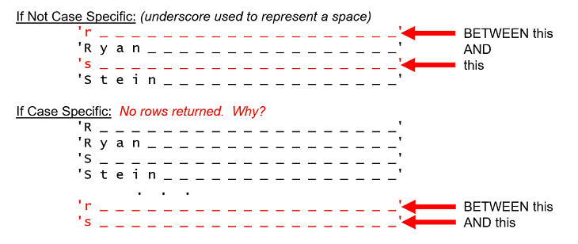
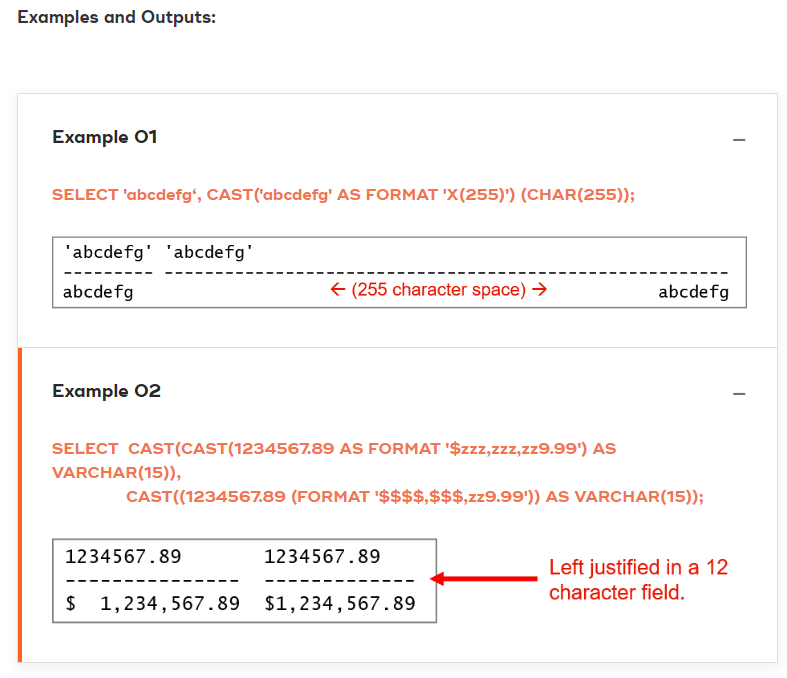

- [SQL Classes](#sql-classes)
- [Basic SELECT Clause](#basic-select-clause)
  - [Namespacing](#namespacing)
  - [Aliasing](#aliasing)
  - [ORDER BY](#order-by)
  - [Returning Literal Values](#returning-literal-values)
  - [ASCII Collating Sequence](#ascii-collating-sequence)
    - [The ASCII Collating Sequence and Teradata Mode:](#the-ascii-collating-sequence-and-teradata-mode)
    - [The ASCII Collating Sequence and ANSI Mode](#the-ascii-collating-sequence-and-ansi-mode)
  - [DISTINCT](#distinct)
  - [Built-In System Variables](#built-in-system-variables)
  - [Recommended Coding Convention](#recommended-coding-convention)
- [Logical Operators](#logical-operators)
  - [Operators](#operators)
  - [Basic Logical Operators](#basic-logical-operators)
    - [Comparing Characters](#comparing-characters)
    - [IN](#in)
    - [LIKE](#like)
    - [ESCAPE Feature of LIKE](#escape-feature-of-like)
    - [NOT IN](#not-in)
    - [XOR](#xor)
    - [BETWEEN](#between)
      - [BETWEEN with CHAR](#between-with-char)
      - [Incorrect Sequencing of the BETWEEN](#incorrect-sequencing-of-the-between)
  - [NULL](#null)
    - [Negation of unknown is unknown](#negation-of-unknown-is-unknown)
    - [Conditional Expressions and NULL](#conditional-expressions-and-null)
    - [Comparing a column with NULL and comparing a column with another column with NULL value is not same](#comparing-a-column-with-null-and-comparing-a-column-with-another-column-with-null-value-is-not-same)
  - [Operator Precedence](#operator-precedence)
  - [Parentheses have highest precedence](#parentheses-have-highest-precedence)
- [Data Types](#data-types)
  - [Three Character data types](#three-character-data-types)
    - [CHAR](#char)
    - [VARCHAR](#varchar)
    - [CLOB](#clob)
  - [Integer](#integer)
  - [Arithematic Functions](#arithematic-functions)
  - [Date Arithematics](#date-arithematics)
  - [Data Type Casting](#data-type-casting)
  - [Rounding](#rounding)
  - [Concatenation](#concatenation)
  - [Format](#format)
    - [Methods for FORMAT in ODBC and JDBC Tools](#methods-for-format-in-odbc-and-jdbc-tools)
    - [Year, Month and Day formatting](#year-month-and-day-formatting)
  - [Period Data Type](#period-data-type)
  - [MISC](#misc)
- [Functions](#functions)
  - [UPPER and LOWER | ANSI standard](#upper-and-lower--ansi-standard)
    - [Case Sensitivity](#case-sensitivity)
  - [CHARACTER_LENGTH | ANSI compliant](#character_length--ansi-compliant)
  - [TRIM | ANSI Standard](#trim--ansi-standard)
    - [TRIMMING Numbers](#trimming-numbers)
  - [POSITION | ANSI standard](#position--ansi-standard)
  - [SUBSTRING / SUBSTR | ANSI standard](#substring--substr--ansi-standard)
    - [SUBSTRING and Numbers](#substring-and-numbers)
  - [CASESPECIFIC | TD Extension](#casespecific--td-extension)
  - [EXTRACT | partially ANSI compliant](#extract--partially-ansi-compliant)
  - [ADD_MONTHS | TD extension](#add_months--td-extension)
  - [DEFAULT | partially ANSI compliant](#default--partially-ansi-compliant)
  - [Calendars | TD Extension](#calendars--td-extension)
  - [PIVOT](#pivot)
  - [UNPIVOT](#unpivot)
- [Subqueries](#subqueries)
- [Joins](#joins)
  - [Inner Join](#inner-join)
    - [Subquery vs Inner Join](#subquery-vs-inner-join)
      - [Table Name Qualifications and Aliasing](#table-name-qualifications-and-aliasing)
    - [Implicit and Explicit Forms](#implicit-and-explicit-forms)
    - [Many-Table INNER JOINs](#many-table-inner-joins)
    - [Using Parenthesis to understand order](#using-parenthesis-to-understand-order)
    - [IN vs INNER JOIN](#in-vs-inner-join)
    - [NOT IN vs INNER JOIN](#not-in-vs-inner-join)
  - [Self Join](#self-join)
  - [Guaranteeing uniqueness](#guaranteeing-uniqueness)
  - [CROSS JOIN](#cross-join)
  - [Cartesian Product Join](#cartesian-product-join)
  - [Outer Join](#outer-join)
    - [Simulating an Outer Join](#simulating-an-outer-join)
    - [Syntax](#syntax)
- [SET Operators](#set-operators)
  - [UNION](#union)
  - [UNION ALL](#union-all)
  - [INTERSECT](#intersect)
  - [MINUS / EXCEPT](#minus--except)
  - [EXCEPT ALL](#except-all)
- [Correlated Subqueries](#correlated-subqueries)


# SQL Classes
SQL Commands can be grouped into following depending on their functionality: 
- DDL (Data Definition Language) 
  - CREATE
    - Define a database object (table, view, macro, index, trigger, or stored procedure)
  - DROP
    - Remove a database object
  - ALTER
    - Change a database object
  - MODIFY
- DML (Data Manipulation Language) 
  - SELECT
  - INSERT
  - UPDATE
  - DELETE
- DCL (Data Control Language)
  - GRANT
    - Give user privileges on database objects
  - REVOKE
  - GIVE
    - Transfer database ownership


# Basic SELECT Clause


## Namespacing

Two possible methods to obtain a list of all the valid department names using a simple SQL SELCT are:

```sql
SELECT  Department_Name
   FROM  Department;
SELECT  Customer_Service.Department.Department_Name
   FROM  Customer_Service.Department;
```

Result of the above two queries (or a similar one) determine: 

- The order of the result appears to be random.
- Character data is left justified.
- Numeric column values are right justified
- The default column heading is the column name which is also left justified due to the column being character.
-  values showing a “?” represent NULLs

## Aliasing

<!-- <p align="center">centered text</p> -->
> create new column headings

```sql
SELECT Department_Number                 AS "Dept Nbr"
               ,Department_Name          AS DeptName
               ,Budget_Amount            AS Budget
               ,Manager_Employee_Number  AS Mgr#
FROM Employee_Sales.Department;
```

OR

```sql
SELECT Department_Number                  "Dept Nbr"
               ,Department_Name           DeptName
               ,Budget_Amount             Budget
               ,Manager_Employee_Number   Mgr#
FROM Employee_Sales.Department;
```

## ORDER BY


```sql
SELECT * FROM Department ORDER BY second_column_name;

-- OR

-- using the column number (not index) rather than name
SELECT * FROM Department ORDER BY 2;
```

- The default ORDER BY is ascending.
- You could order explicitly doing either of these: 
  - ORDER BY DeptName ASC; 
  - ORDER BY DeptName DESC;


> ORDER BY for each column can have different ordering
```sql
SELECT  Department_number, Budget_Amount, Manager_Employee_Number
FROM    Employee_Sales.Department
ORDER BY 3 DESC, 1;
```


## Returning Literal Values

With SQL, you can project literal values as well as column values. 

```sql
SELECT       
'Department number'     AS Character_Literal                     
12345                   AS Numeric_Literal
FROM          Department
ORDER BY 1;
```

Result of Above query produces:


- number of rows returned will be the total number of rows in Department table
- Character literals are enclosed inside single quotes while numeric data is not


> NOTE: A literal value can be selected without reference to a table

```sql
SELECT ‘Hello world’ as Character_Literal
,12345 as Numeric_Literal
;  
```


## ASCII Collating Sequence

- numbers always sort before characters
- 

### The ASCII Collating Sequence and Teradata Mode:


- The sort sequence for Teradata Mode is on the right.
- **In Teradata Mode, upper and lower case values for the same letter are equal.**
- **Teradata Mode is not case sensitive.**
- The issue of case sensitivity affects upper and lower case letters.
- Here **upper and lower case sort the same**, so it only matters that the letter “a/A” is show before the letter “z/Z”, in any order.

### The ASCII Collating Sequence and ANSI Mode


- The sort sequence for ANSI Mode is on the right.
- In ANSI Mode, upper and lower case values for the same letter are different.
- ANSI Mode is case sensitive.
- The issue of case sensitivity affects upper and lower case letters.
- Here upper and lower case sort differently, with **upper case values sorting before lower case values**

 
## DISTINCT

-  appear first in the SELECT list.


## Built-In System Variables

- SESSION - contains the session-id
- DATABASE - contains the current database
- ACCOUNT - contains the user account info
- USER - contains the user name for this session
- PROFILE
- DATE/CURRENT_DATE
- TIME/CURRENT_TIME
- TIMESTAMP/CURRENT_TIMESTAMP


> Those having `CURRENT_` in the name are ANSI standard.

> System values, like any other literal values do not need a FROM clause in the SELECT Statement.

```sql
-- valid SELECT
SELECT DATE, CURRENT_DATE, CURRENT_TIME, CURRENT_TIMESTAMP, PROFILE;
```

## Recommended Coding Convention

- paragraph-style, can be difficult to debug.


# Logical Operators

## Operators
- May reference columns, literals or NULLs
- They are generally in comparisons

## Basic Logical Operators

- Constraints
  - ANSI Standard, symbols 
  - Teradata Extension, abbreviations 


- Equal
  - =
  - EQ
- Not Equal
  - <>
  - NE
- Less Than
  - <
  - LT
- Greater Than
  - />
  - GT
- Greater Than Equal To
  - />=
  - GE
- Less Than Equal To
  - <=
  - LE


Common in both ANSI and Teradata

- BETWEEN ... AND
- [NOT] IN
- IS [NOT] NULL
 
### Comparing Characters

> When comparing two character strings of different lengths, the database pads the shorter string to the right with spaces, making them the same length which means trailing spaces do not change the value of a character field.

```sql

-- true
'190 ' = '190'

-- true
'abc' = 'ABC'

-- false
' abc' = 'abc '

-- false
'' = null

-- true
'' = ''
```

### IN

- can have single value
- can have numerical value


```sql
SELECT * 
FROM Employee
WHERE First_Name IN ('alan', 'allen');
```

Equivalent query without `IN` uses `=` and `OR`

```sql
SELECT * 
FROM Employee
WHERE First_Name = 'allen' OR First_Name = 'alan';
```

### LIKE

```sql
WHERE expression1 LIKE ' [ % | _ ] expression2 [ % | _ ] '
```

- LIKE is ANSI Standard.
- accepts two wildcard characters:
  -  “%” (percent)
     -  Any number of characters preceding (or following – depending on placement)
  -  “_” (underscore)
     -  wildcard for representing any character in the required position 


**%:**
```sql
SELECT Last_Name 
FROM Employee 
WHERE Last_Name LIKE '%il%';

-- Equivalent POSITION form
SELECT Last_Name
FROM Employee
WHERE POSITION('il' IN Last_Name) > 0;


-- In case when field is of data type CHAR and not VARCHAR you need to TRIM first for searching occurence of pattern in start or end of string, OR add corresponding trailing spaces in search pattern
SELECT Last_Name 
FROM Employee 
WHERE TRIM(Last_Name) LIKE '%il';
```

**_:**

```sql
SELECT Last_Name 
FROM Employee 
WHERE Last_Name LIKE '_r%';
-- returns all Last_Name values where `r` is the second character
```

### ESCAPE Feature of LIKE

When the defined ESCAPE character is in the pattern string, it must be immediately followed by an underscore, percent sign, or another ESCAPE character.

In a left-to-right scan of the pattern string the following rules apply when ESCAPE is specified:

- Until an instance of the ESCAPE character occurs, characters in the pattern are interpreted at face value.
- When an ESCAPE character immediately follows another ESCAPE character, the two character sequence is treated as though it were a single instance of the ESCAPE character, considered as a normal character.
- When an underscore metacharacter immediately follows an ESCAPE character, the sequence is treated as a single underscore character (not a wildcard character).
- When a percent metacharacter immediately follows an ESCAPE character, the sequence is treated as a single percent character (not a wildcard character).
- When an ESCAPE character is not immediately followed by an underscore metacharacter, a percent metacharacter, or another instance of itself, the scan stops and an error is reported.


**To look for fields where the second character is `_`:**
```sql
SELECT TableName 
FROM DBC.Tables 
WHERE TableName LIKE '_x_%' 
ESCAPE 'x';
```


**To look for the pattern ‘95%’ in a string such as ‘Result is 95% effective’, if Result is the field to be checked, use:**

```sql
...
WHERE Result LIKE '%95Z%%' ESCAPE 'Z'
```


### NOT IN

```sql
SELECT * 
FROM Employee
WHERE First_Name NOT IN ('alan', 'allen');
```

Equivalent query without `IN` uses `<>` and `AND`

```sql
SELECT * 
FROM Employee
WHERE First_Name <> 'allen' AND First_Name <> 'alan';
```

### XOR

An exclusive OR is where one condition or the other condition are true, but both are not true.

> Retrieve employee whose first names are Alan OR Last Names are Brown, but not both.

```sql
SELECT * 
FROM Employee 
WHERE (Last_Name = 'Brown' AND First_Name <> 'Alan')
        OR (Last_Name <> 'Brown' AND First_Name = 'Alan');
```

### BETWEEN

- inclusive, given range also included
- first value of range should be <= second value of range
- case insensitive

```sql
SELECT * 
FROM Employee 
WHERE department_number BETWEEN 401 and 567;
```


#### BETWEEN with CHAR

```sql
WHERE Last_Name BETWEEN 'r' AND 's'
```



#### Incorrect Sequencing of the BETWEEN
- first value of range should be <= second value of range
- can be used for character values


## NULL

- NULL represents something that is unknown
- NULL is a “keyword”
- NULL is neither a data type nor a characteristic of data
- When doing an ascending sort, NULL syntax sorts before numbers and characters (including spaces and zeroes
- Any arithmetic operation involving a NULL operand (literal, column, or expression) computes a NULL result
  - Col_A  [ +  -  *  / ]  Col_B  =  NULL
- Although some SQL Utilities will show the '?' character to represent a NULL, that character is not stored in the database.  Other SQL utilities will show a blank cell or the actual word 'null' or 'NULL' to represent a NULL.
- valid uses of referencing NULL
  - WHERE c1 IS NULL
  - SELECT NULL
- Any logical conditional expression involving a NULL operand (literal, column, or expression) evaluates as “unknown” (Not True AND Not False)

### Negation of unknown is unknown

- Any logical conditional expression involving a NULL operand (literal, column, or expression) evaluates as “unknown” (Not True AND Not False)
  - Col_A  [ >,   >=,   <,  <=,  =,   <> ]  Col_B -> result is unknown
    - Negation of unknown is NOT TRUE
    - If result of condition is unknown for a row then that row won't appear in result of query


To retrieve employees other than those in department number 401, you can perform either of the following:

```sql
SELECT    *
FROM    Employee
WHERE  Department_Number <> 401;

-- or negate the condition:
SELECT    *
FROM    Employee
WHERE NOT (Department_Number = 401);
```

> Same applies for `IN`, because it in the backend is converted into its form containing equality operator and if one of the row in desired column is null then for that row the result of `IN` is `unknown` rather than `TRUE`, so the row under test is not shown and rest of the TRUE conditioned rows are shown, whereas if it was `NOT IN` query then **no row is returned** because `NOT IN` is translated into it's `<>` and `AND` form.

```sql
SELECT * 
FROM Employee
WHERE Department_Number IN (401, 403, null);
```


**Correct query:**

```sql
SELECT * 
FROM Employee 
WHERE Department_Number IS NULL
OR Department_Number IN (401, 403);
```

**Now Rows found:**
```sql
SELECT * 
FROM Employee 
WHERE Department_Number 
NOT IN (401, 403, null);
```

**Correct Query:**
```sql
SELECT * 
FROM Employee 
WHERE Department_Number IS NOT NULL
AND Department_Number NOT IN (401, 403);
```

### Conditional Expressions and NULL

**Incorrect Usage:**
```sql
WHERE  Salary = NULL 
WHERE  Salary = '' -- (two single quotes does not equate to NULL)
WHERE Salary = "" -- (two double quotes does not equate to NULL)
WHERE  Salary  NOT= NULL 
WHERE  Salary  <> NULL  
```

**Correct Usage:**
```sql
WHERE  Salary IS NULL  
WHERE  Salary IS NOT NULL 
```

### Comparing a column with NULL and comparing a column with another column with NULL value is not same

Logically and semantically, there is a subtle but distinct difference between:

- Comparing two columns, where one or both contain a null (e.g., WHERE Col1 = Col2)
- Asking if a column or expression result is null (i.e., WHERE Col1 IS NULL)

## Operator Precedence

Evaluation Precedence:
- ()
- Exponentiation
- Multiplication, Division, and Modulo (left to right)
- Addition and Subtraction (left to right)
- NOT operators
- AND operators
- OR operators
- Operators of equal precedence evaluated from left to right

## Parentheses have highest precedence

```sql
SELECT    * 
FROM      Employee 
WHERE     (Last_Name = 'brown'
AND       Department_Number = 401)
OR        (First_Name = 'mary');
```

Rearranging the parentheses changes the business question.

From the same table (as above), retrieve employees with last name of Brown, and first name of Mary or work in department 401.

```sql
SELECT    * 
FROM      Employee 
WHERE     (Last_Name = 'brown')
AND       (Department_Number = 401
OR        First_Name = 'mary');
```

# Data Types

- All values for all types require storage space
- The system default value for all types is NULL

<table style="width:100%;margin-right:calc(0%);margin-left:calc(0%);"><thead><tr><th style="width:18.5568%;background-color:rgb(255, 99, 30);"><span style="color:rgb(255, 255, 255);font-weight:bold;">TYPE</span></th><th style="width:34.611%;background-color:rgb(255, 99, 30);"><span style="color:rgb(255, 255, 255);font-weight:bold;">Name</span></th><th style="width:11.7538%;background-color:rgb(255, 99, 30);"><span style="color:rgb(255, 255, 255);font-weight:bold;">Bytes</span></th><th style="width:35.1765%;background-color:rgb(255, 99, 30);"><span style="color:rgb(255, 255, 255);font-weight:bold;">Description</span></th></tr></thead><tbody><tr><td style="text-align:left;width:18.5568%;"><strong>Date/Time</strong><br></td><td style="text-align:left;width:34.611%;">DATE<br></td><td style="text-align:left;width:11.7538%;">4<br></td><td style="text-align:left;width:35.1765%;">YYYY-MM-DD<br></td></tr><tr><td style="text-align:left;width:18.5568%;"><br></td><td style="text-align:left;width:34.611%;">TIME (WITH ZONE)<br></td><td style="text-align:left;width:11.7538%;">6/8<br></td><td style="text-align:left;width:35.1765%;">HH:MM:SS.S(F)Z<br></td></tr><tr><td style="text-align:left;width:18.5568%;"><br></td><td style="text-align:left;width:34.611%;">TIMESTAMP (WITH ZONE)<br></td><td style="text-align:left;width:11.7538%;">10/21<br></td><td style="text-align:left;width:35.1765%;">YYYY-MM-DD HH:MM:SS.S(F)Z<br></td></tr><tr><td style="text-align:left;width:18.5568%;"><strong>Period</strong></td><td style="text-align:left;width:34.611%;">PERIOD(DATE)</td><td style="text-align:left;width:11.7538%;">8<br></td><td style="text-align:left;width:35.1765%;">Temporal</td></tr><tr><td style="text-align:left;width:18.5568%;"><br></td><td style="text-align:left;width:34.611%;">PERIOD(TIME(n) [WITH TIME ZONE]), <span style="color:rgb(211, 71, 60);">PERIOD(TIMESTAMP(n) [WITH TIME ZONE])</span><br></td><td style="text-align:left;width:11.7538%;">12-24</td><td style="text-align:left;width:35.1765%;"><br></td></tr><tr><td style="text-align:left;width:18.5568%;"><strong>Numeric</strong></td><td style="text-align:left;width:34.611%;">DECIMAL or NUMERIC (n, m)<br></td><td style="text-align:left;width:11.7538%;">2, 4, 6, 8, 16</td><td style="text-align:left;width:35.1765%;">+ OR –<br></td></tr><tr><td style="text-align:left;width:18.5568%;"><br></td><td style="text-align:left;width:34.611%;">BYTEINT<br></td><td style="text-align:left;width:11.7538%;">1</td><td style="text-align:left;width:35.1765%;">-128 to +127<br></td></tr><tr><td style="text-align:left;width:18.5568%;"><br></td><td style="text-align:left;width:34.611%;">SMALLINT</td><td style="text-align:left;width:11.7538%;">2</td><td style="text-align:left;width:35.1765%;">-32,768 to +32,767<br></td></tr><tr><td style="text-align:left;width:18.5568%;"><br></td><td style="text-align:left;width:34.611%;">INTEGER</td><td style="text-align:left;width:11.7538%;">4</td><td style="text-align:left;width:35.1765%;">-2,147,483,648 to +2,147,483,647<br></td></tr><tr><td style="text-align:left;width:18.5568%;"><br></td><td style="text-align:left;width:34.611%;">BIGINT<br></td><td style="text-align:left;width:11.7538%;">8</td><td style="text-align:left;width:35.1765%;">-263 to +263 - 1 (+9,223,372,036,854,775,807)<br></td></tr><tr><td style="text-align:left;width:18.5568%;"><br></td><td style="text-align:left;width:34.611%;">FLOAT, REAL, DOUBLE PRECISION<br></td><td style="text-align:left;width:11.7538%;">8</td><td style="text-align:left;width:35.1765%;">IEEE floating point<br></td></tr><tr><td style="text-align:left;width:18.5568%;"><br></td><td style="text-align:left;width:34.611%;"><span style="color:rgb(211, 71, 60);">NUMBER (n) or NUMBER (n ,m)</span><br></td><td style="text-align:left;width:11.7538%;">0-18</td><td style="text-align:left;width:35.1765%;">± 1E-130 to 9.99…9E125 (TD 14.0)<br></td></tr><tr><td style="text-align:left;width:18.5568%;"><strong>Byte</strong></td><td style="text-align:left;width:34.611%;">BYTE (n)</td><td style="text-align:left;width:11.7538%;">1-64,000</td><td style="text-align:left;width:35.1765%;"><br></td></tr><tr><td style="text-align:left;width:18.5568%;"><br></td><td style="text-align:left;width:34.611%;">VARBYTE (n)</td><td style="text-align:left;width:11.7538%;">1-64000,</td><td style="text-align:left;width:35.1765%;"><br></td></tr><tr><td style="text-align:left;width:18.5568%;"><br></td><td style="text-align:left;width:34.611%;">BLOB</td><td style="text-align:left;width:11.7538%;">8-2 GB</td><td style="text-align:left;width:35.1765%;">Binary Large Object<br></td></tr><tr><td style="text-align:left;width:18.5568%;"><strong>Geospatial</strong><br></td><td style="text-align:left;width:34.611%;">ST_GEOMETRY, MBR<br></td><td style="text-align:left;width:11.7538%;">8-16 MB</td><td style="text-align:left;width:35.1765%;">Geospatial<br></td></tr><tr><td style="text-align:left;width:18.5568%;"><strong>XML</strong></td><td style="text-align:left;width:34.611%;">XML, XMLTYPE<br></td><td style="text-align:left;width:11.7538%;">8-2 GB</td><td style="text-align:left;width:35.1765%;">eXtensible Markup Language (XML) (TD 14.10)<br></td></tr><tr><td style="text-align:left;width:18.5568%;"><strong>Character</strong></td><td style="text-align:left;width:34.611%;">CHAR (n)<br></td><td style="text-align:left;width:11.7538%;">1-64,000<br></td><td style="text-align:left;width:35.1765%;"><br></td></tr><tr><td style="text-align:left;width:18.5568%;"><br></td><td style="text-align:left;width:34.611%;">VARCHAR (n)</td><td style="text-align:left;width:11.7538%;">1-64,000<br></td><td style="text-align:left;width:35.1765%;"><br></td></tr><tr><td style="text-align:left;width:18.5568%;"><br></td><td style="text-align:left;width:34.611%;">LONG VARCHAR</td><td style="text-align:left;width:11.7538%;"><br></td><td style="text-align:left;width:35.1765%;">Same as VARCHAR (64,000)</td></tr><tr><td style="text-align:left;width:18.5568%;"><br></td><td style="text-align:left;width:34.611%;">GRAPHIC</td><td style="text-align:left;width:11.7538%;">1-32,000</td><td style="text-align:left;width:35.1765%;"><br></td></tr><tr><td style="text-align:left;width:18.5568%;"><br></td><td style="text-align:left;width:34.611%;">VARGRAPHIC</td><td style="text-align:left;width:11.7538%;">1-32,000</td><td style="text-align:left;width:35.1765%;"><br></td></tr><tr><td style="text-align:left;width:18.5568%;"><br></td><td style="text-align:left;width:34.611%;">LONG VARGRAPHIC</td><td style="text-align:left;width:11.7538%;"><br></td><td style="text-align:left;width:35.1765%;">same as VARGRAPHIC (32,000)</td></tr><tr><td style="text-align:left;width:18.5568%;"><br></td><td style="text-align:left;width:34.611%;">CLOB</td><td style="text-align:left;width:11.7538%;">2-8 GB<br></td><td style="text-align:left;width:35.1765%;">Character Large Object</td></tr></tbody></table>


## Three Character data types

```sql
CREATE TABLE Data_Types
(Last_Name       CHAR(20), 
First_Name       VARCHAR(20),
Thesis           CLOB(2M) );
```

### CHAR
- Fixed Character, left justified, right padded with spaces to fill the length.
- Example for last name is always 20 characters and 20 bytes of storage.

### VARCHAR

- Variable length
- Spaces count as valid characters. **2 bytes of overhead**
- They may be used to store numeric values
- VARCHAR(0) is invalid
- The number of bytes for storage varies according to the value
- Examples: “this value” has 10 characters and takes 10 bytes of storage   (+ overhead) “this value   ” has 13 characters and takes 13 bytes of storage (+ overhead)

### CLOB

- CLOB(n[K|M|G]) (Character Large OBject – Kilobytes; Megabytes; Gigabytes)
- Fixed length up to 2GB in size.
- Examples:  CLOB(3200) – CLOB(32K) – CLOB(32M) – CLOB(2G)


## Integer

- BYTEINT
  - Teradata extension **1 byte** of storage 
  - Range: -128 to +127
  - Characters needed to display: **4**
- SMALLINT
  - ANSI Standard
  - **2 bytes** of storage
  - Range: -32,768 to +32,767
  - Characters needed to display: **6**
- INTEGER
  - ANSI Standard
  - **4 bytes** of storage
  - Range:  -2,147,483,648 to +2,147,483,647
  - Characters needed to display: **11**
- BIGINT
  - ANSI Standard
  - **8 bytes** of storage (more expensive)
  - Range: ± 9,233,372,036,854,775,807
  - Characters needed to display: **20**


- Decimal
  - represented by the syntax DECIMAL(m, n) or DEC(m, n) or NUMERIC(m, n) ,where:
    - “m” is the total number of digits. (maximum value for “m” is 38).
    - “n” is the number of decimal digits. (<= “m”).
    - Storage Requirements
      - When value of “m” is:                                
        - Then:
      - 1 or 2 (fits into BYTEINT)                      
        - Uses 1 byte of storage.
      - 3 or 4 (fits into SMALLINT)                  
        - Uses 2 bytes of storage.
      - 5 to 9 (fits into INTEGER)                     
        - Uses 4 bytes of storage.
      - 10 to 18                                                  
        - Uses 8 bytes of storage.
      - 18 to 38 (more expensive)                     
        - Uses 16 bytes of storage.

- Float
  - Number in the range of 2 X 10-307 to 2 X 10+308 can be used to represent a very large number, but with only 15 digits of precision
  - an exponentially represented numeric value

- Byte
  - Never translated by the Teradata Database.
  - Handled as if they were n-byte, unsigned binary integers.
  - Suitable for digitized image information (BLOB)
  - **BYTE(n)** / **VARBYTE(n)** - Where “n” = Number of bytes between 1 and 64,000 (These two are Teradata extensions to the ANSI syntax).
  - **BLOB(n[K|M|G])** - (Binary Large OBject) - Fixed length up to 2GB in size.
- Date
  - Is stored internally as data type INTEGER  (4 bytes of storage).
  - Supports full date intelligent arithmetic.
  - ANSI Standard form for literal is DATE 'YYYY-MM-DD'
  - Minimum date is: DATE '0001-01-01'

**using DATE in a query:**
```sql
SELECT *
FROM Data_Types
WHERE
BirthDate < DATE '2000-01-01';
```

- Array
  - The Teradata ARRAY data type is a user-defined type (UDT). This differs from the ANSI Standard which does not consider an ARRAY data type to be a UDT.
  - It also supports an Oracle-compatible form of ARRAY type called VARRAY. However, unlike the Oracle VARRAY data type, the Teradata VARRAY type can be defined in multiple dimensions.
- Number
  - NUMBER or NUMBER(*) / NUMBER(n) or NUMBER(n, m)
  - This is effectively a variable length numeric data type.
    - Greater efficiency in storing numeric data because the number of bytes to store the data can vary from 0-18 bytes depending on the value stored.
    - NUMBER is effectively stored as a variable length number.  2 or 4 bytes are used in the column offset array to represent the starting location of this column in the internal data row.
  - Range for NUMBER data type is ± 1E-130 to 9.99…9E125.
  - It has more flexibility, range, and precision for numeric data.
    - More flexibility in defining numeric columns by providing the ability to change the precision or scale of existing NUMBER columns in tables without modifying the data rows.
    - More flexibility in computation compared with the DECIMAL data type because the result is not limited by the precision or scale of the input.
    - Greater range than the DECIMAL data type.
    - Greater accuracy than the FLOAT data type because NUMBER has greater guaranteed precision. NUMBER can represent common decimals exactly.
  - Increased compatibility with other databases, which include a similar NUMBER data type.


## Arithematic Functions

- FUNCTION( arg1 [, arg2, , , arg3]), where “arg” is an abbreviation for “argument” and could be any of the following:  
    - Literals
    - Columns
    - Expressions involving literals and/or columns


Note: These arithmetic functions are Teradata extensions to the ANSI Standard.

**Some Functions:**

- ABS(arg)
- EXP(arg)
  - e**arg
- LOG(arg)
  - base 10 log
- LN(arg)
  - base e log
- SQRT(arg)

```sql
Select ABS(col1) 
from table_a;

Select SQRT (col1*3+col2)
from table_b;

```

## Date Arithematics

```sql
-- The date 40 days from today.
SELECT CURRENT_DATE + 40;

-- The date 300 days from a specific date.
SELECT DATE '1999-01-01' + 300; 

-- The number of days between the 2 dates.
SELECT CURRENT_DATE - DATE '2007-11-30';

-- The number of days each employee has worked for the company
SELECT CURRENT_DATE - Hire_Date FROM Employee; 

-- The employees who have worked for the company for more than 20 years.
SELECT * FROM Employee WHERE CURRENT_DATE - Hire_Date > 365.25 * 20;

-- The employees who were hired within the last 100 days.
SELECT * FROM employee WHERE Hire_Date > CURRENT_DATE - 100;

```

## Data Type Casting

-  CAST( expression AS data type )
-  Some examples of using CAST are as follows:
  - SELECT CAST(Last_Name AS CHAR(10)) FROM Employee;
  - SELECT CAST(3.7777 AS INTEGER);
    - (This will truncate the decimal portion.)
  - SELECT CAST(Budget_Amount * 1.375 AS DEC(15,3)) FROM Department;
  - SELECT CAST(1.777 AS CHAR(10));
    - (This will convert 1.777 into a CHAR data type that occupies 10 spaces.  The characters are stored left to right in the field.)
  - SELECT CAST(Salary_Amount AS CHAR(11)) FROM Employee;
  - SELECT CAST(1.77 AS CHAR(2));
    - (This will truncate the decimal to “1.”, left justified as a two character field.)

```sql
SELECT CAST(Last_Name AS INTEGER) FROM Employee;

-- Failed [2621 : HY000] Bad character in format or data...
-- Select statement Failed.
```

## Rounding

> There are two methods for Rounding. Each method is determined by a setting in a group of parameters that a database administrator maintains, called the DBSControl Record. One important thing to know and understand is how rounding takes place inside the system.  RoundHalfWayMagUp is used to determine how raounding is performed when computing values of DECIMAL type.  A halfway value is exactly halfway between representable decimal values.  When this parameter is set to TRUE, then 2.5 is rounded to 3.  When the paramter is set to FALSE, 2.5 is rounded to 2.  The Vantage default setting is FALSE.


<!-- idk -->
- DBSControl – RoundHalfWayMagUp (True)

```sql
SELECT CAST(1.34999 AS DEC(2,1)); < 5, (round down - 1.3)
SELECT CAST(1.35000 AS DEC(2,1)); >= 5, (round up - 1.4)
SELECT CAST(1.36001 AS DEC(2,1)); >= 5, (round up - 1.4)
SELECT CAST(1.45000 AS DEC(2,1)); >= 5, (round up - 1.5)
```

- DBSControl – RoundHalfWayMagUp (False - default setting)

```sql
SELECT CAST(1.34999 AS DEC(2,1)); < 5, (round down - 1.3)
SELECT CAST(1.35000 AS DEC(2,1)); = 5, (round to the even number - 1.4)
SELECT CAST(1.36001 AS DEC(2,1)); > 5, (round up - 1.4)
SELECT CAST(1.45000 AS DEC(2,1)); = 5, (round to the even number - 1.4)
```

## Concatenation

Concatenation is a method for combining two or more columns or expressions into a larger, single field of character data type using an implicit CAST.

Two consecutive pipe characters (or vertical bars) are interpreted by the database as a request to perform a concatenation of fields.


```sql
SELECT Last_Name || First_Name FROM Employee;
SELECT Last_Name || ', ' || First_Name FROM Employee;
SELECT First_Name||' '||Last_Name||' is '||(DATE - Birthdate)/365 FROM Employee;
SELECT 123||'ABC'||456;
```

In the above example, the single field results will have a data type of VARCHAR. You can CAST the result of a concatenation as follows:

```sql
SELECT CAST(Last_Name ||', '|| First_Name AS CHAR(100))
FROM Employee;
SELECT CAST(123||'ABC'||456 AS CHAR(3));  -- This will result in a truncation
```
<!-- idk -->
```sql
SELECT 123||'ABC'||456  AS  Concat;
```


In the above Example , 123 is data type BYTEINT.  (3 digits and the sign are a total of 4 characters, right justified)
data type of 456 is Integer

## Format

- You can reformat the appearance of how a value is displayed by using FORMAT.
- Note: FORMAT is a Teradata extension to the ANSI Standard.
- Although there are many different formatting options, following are the the ones that are used for dates (later):
  - “-” Dash
  - “%” Percent sign
  - “$” Dollar sign
  - “Z” Leading zero suppress (“Z” or “z”)
  - “9” Show leading or trailing zeroes
  - “X” Character display (“X” or “x”)
  - “.” Decimal or period
  - “,” Comma
  - “B” Blank or space  (“B” or “b”)
  - “/” Slash or division sign
  - “:” Colon


> A FORMAT specification can contain a maximum of 30 characters.
> A FORMAT phrase can describe up to 18 digit positions.
> The output string produced using a FORMAT phrase can have a maximum of 255 characters.

### Methods for FORMAT in ODBC and JDBC Tools

Let us look at the different styles used for formatting result fields.
The following formatting styles are available to use while using SQL Assistant or Teradata Studio.
- SELECT CAST( (Salary_Amount (FORMAT '$$$$,$$$,$$9.99') ) AS CHAR(15) ) . . .
- SELECT CAST( CAST(Salary_Amount AS FORMAT '$$$$,$$$,$$9.99') AS CHAR(15) ) . . .



### Year, Month and Day formatting

The following can be used for Date formatting. (Lower case is allowed.)

- Y4 - Four digit year (use also 'YYYY')
- YY - Two digit year
- M4 - Full name of month (use also 'MMMM')
- M3 - Three character abbreviation (use also 'MMM')
- MM - Two digit month
- E4 - Full day of week name (use also 'EEEE')
- E3 - Abbreviated day of week name (use also 'EEE')
- D3 - three digit day of year (use also 'DDD') -- not day of the month
- DD - wo digit day of month


## Period Data Type


- A PERIOD data type indicates an anchored duration of two DateTime data types (such as two DATE values, two TIMESTAMP values, etc.) that indicate when a particular event starts and ends.
- A PERIOD data type is stored in a single column.
- The PERIOD data type value representation is **inclusive-exclusive**.

The following is an example of a period starting on 1 February 2008 and extends up to, but not including, 10 February 2008.

```sql
PERIOD(DATE '2008-02-01', DATE '2008-02-10')
```

Example of a formatted Period data type in a CREATE TABLE and INSERT is as follows.


**Create Table:**
```sql
CREATE TABLE Employee (
Emp_No INTEGER,  
Emp_Name CHAR(100),  
Job_Duration PERIOD(DATE) FORMAT'YYYY-MM-DD'
);
```

**Insert:**
```sql
INSERT INTO employee1 (Emp_No, Emp_Name, Job_Duration)
VALUES  (101, 'Paul', PERIOD(DATE'2006-02-03', DATE'2008-02-04'));
```

## MISC
- Concatenated results are always displayed left justified
- Default headings are the name of the column or expression


# Functions

- Non-ANSI Compliant
- Partially ANSI Compliant (a Teradata function supporting some of the ANSI requirements, but not all)
- Fully ANSI Compliant (a Teradata function supporting the full set of ANSI requirements)
- Functions return a single result.
- Some functions may be fully compliant and yet provide extended capabilities supporting functionality beyond those defined by the ANSI standard.

## UPPER and LOWER | ANSI standard

```sql
SELECT     CAST(First_Name AS CHAR(10)) AS FName,
           CAST(Last_Name AS CHAR(10)) AS LName,                     
           CAST(UPPER(First_Name) AS CHAR(10)) AS U_FName,     
           CAST(LOWER(Last_Name) AS CHAR(10)) AS L_LName
FROM Employee 
WHERE Employee_Number = 1010;
```


### Case Sensitivity

- Transaction processing in Teradata mode is not case specific (not case sensitive).
- if the column is defined as CASESPECIFIC then it is case sensitive
- You can then make the query that is not case sensitive (NOT CASESPECIFIC) by performing a “case-blind” test by using either UPPER or LOWER.


**case-blind test:**
```sql
SELECT Last_Name 
FROM Employee 
WHERE UPPER(Last_Name) = 'TRADER';
```

## CHARACTER_LENGTH | ANSI compliant

- Returns an INTEGER number that represents the number of characters in a CHARACTER string.  
- If a field  is defined as CHARACTER(**x**). This means that every value contains **x** characters.
- If a field  is defined as VARCHAR(**x**). This means that every value contains variable characters but not more then **x**, if **fname**, a VARCHAR(20) is **Anna** then it contains only 4 characters.


## TRIM | ANSI Standard
- Removes LEADING, TRAILING, or BOTH of a defined character from a string
- Default is BOTH
- performs an implicit CAST to character prior to doing the trim on numeric data


```sql
SELECT TRIM(TRAILING FROM 'abc         ') || 'XYZ';
SELECT TRIM(TRAILING ' ' FROM 'abc ') || 'XYZ';

-- abcXYZ


SELECT 'abc_______',  TRIM(TRAILING '_' FROM 'abc_______');
-- abc_______ abc
```

### TRIMMING Numbers
- the database performs an implicit CAST to character prior to doing the trim
- The issue with using CAST is knowing how big to make the character length if it were a column instead of a literal. 
- alignment of the trimmed result - Left alignment


## POSITION | ANSI standard
- Returns an INTEGER value representing the numeric position of the **first occurance** of first argument (**X**) in the second argument (**Y**)
- Returns 1 if length of **X** is 0  
- Return null if either argument is **null**
- Only works on character data


```sql
SELECT Last_Name, POSITION('i' IN Last_Name) AS ColPos
FROM Employee
WHERE ColPos > 0;
```

## SUBSTRING / SUBSTR | ANSI standard 
- SUBSTRING (expression1 FROM n1 [ FOR n2 ] )
  - n1 = start position, **not zero indexed**
  - n2 = number of characters, till end if n2 is absent
-  perform an implicit cast of numeric to character.

```sql
SELECT SUBSTRING( 'Contact' FROM 8 FOR 6);
-- zero length string (")


SELECT SUBSTRING( 'Contact' FROM -5);
-- Contact


SELECT SUBSTRING( 'Contact' FROM 0 FOR 2);
-- C


SELECT SUBSTRING( 'Contact' FROM -5 FOR 8);
-- Co


SELECT SUBSTRING( 'Contact' FROM 2 FOR -1);
-- Invalid
```


### SUBSTRING and Numbers
- the database performs an implicit conversion to character prior to using SUBSTRING.


**Example:**
34567 is an integer cast, right-justified, into an 11-character field (including the sign). Beginning with the 3rd character, it then takes the first 5 characters.


## CASESPECIFIC | TD Extension

- It can be abbreviated as "CS"

```sql
SELECT Last_Name 
FROM Employee 
WHERE Last_Name LIKE '%Ra%' (CASESPECIFIC);

-- Equivalent IN form
SELECT Last_Name 
FROM Employee 
WHERE POSITION(('Ra' (CS)) IN Last_Name) > 0;
```


## EXTRACT | partially ANSI compliant


```sql
SELECT  EXTRACT(YEAR FROM DATE '2010-12-20' + 30)  AS Yr, 
EXTRACT(MONTH FROM DATE '2010-12-20' - 30)         AS Mth,    
EXTRACT(DAY FROM DATE '2010-12-20' + 30)           AS Dy;
```

```sql
SELECT  EXTRACT(HOUR FROM TIME '10:20:30')      AS Hr, 
EXTRACT(MINUTE FROM TIME '10:20:30')  AS Mn,    
EXTRACT(SECOND FROM TIME '10:20:30') AS Scd;
```

## ADD_MONTHS | TD extension

- creates a new date by adding an integer number of months

```sql
SELECT DATE;                                     2018-04-10
SELECT ADD_MONTHS (DATE, 2);                     2018-06-10
SELECT ADD_MONTHS (DATE, 12*14);                 2032-04-10
SELECT ADD_MONTHS (DATE, -11);                   2017-05-10
SELECT ADD_MONTHS ('2001-07-31', 2);             2001-09-30
SELECT ADD_MONTHS ('2003-12-31', 2);             2004-02-29
SELECT ADD_MONTHS ('2003-12-31', 14);            2005-02-28
```

## DEFAULT | partially ANSI compliant

- returns the default value defined for the column
- If no default value is defined, it returns Null


```sql
CREATE TABLE abc (
     c1 CHAR(10)  DEFAULT 'Tuba',  
     c2  VARCHAR(10)  DEFAULT 'Oboe',  
     c3  INTEGER  DEFAULT 0,  
     c4  INTEGER
);

SELECT
DEFAULT(c1)                          AS a,        
SUBSTRING(DEFAULT(c2) FROM 3 FOR 2)  AS b,         
DEFAULT(c3) + c4                     AS c,       
DEFAULT(c3) + DEFAULT(c4)            AS d
FROM abc;
```

> NOTE: DEFAULT(X) + DEFAULT(Y) = unknown if any of X or Y don't have default values

## Calendars | TD Extension


**Using SET SESSION:**
```sql
SET SESSION calendar = TERADATA;
SELECT Calendar_Date, Week_Of_Month
FROM Sys_Calendar.BusinessCal
WHERE Week_Of_Month = 1
AND Month_Of_Year = 1
AND Year_Of_Calendar = 2014;
```

**Using TD_Sysfnlib:**
```sql
SELECT
CURRENT_DATE,

TD_Sysfnlib.DayNumber_of_Month(CURRENT_DATE)     AS DayMonth,
TD_Sysfnlib.DayNumber_of_Year(CURRENT_DATE)      AS DayYear ,
TD_Sysfnlib.WeekNumber_of_Year(CURRENT_DATE)     AS WeekYear ,
TD_Sysfnlib.WeekNumber_of_Month(CURRENT_DATE)    AS WeekMonth ,
TD_Sysfnlib.DayOccurrence_of_Month(CURRENT_DATE) AS DayOccur,
TD_Sysfnlib.MonthNumber_of_Year(CURRENT_DATE)    AS MonthYear,
TD_Sysfnlib.QuarterNumber_of_Year(CURRENT_DATE)  AS QuarterYear;
```


- Numbering or ordering of parts of year with respect to different standards (US, Europe or ISO)
- Since statistics are created for materialized table for join planning. Only necessary rows are materialized for the calendar
- Options
  - Teradata: The first full week of the year starts on Sunday
    - days of SAME year before Sunday constitute week 0 (partial week)
  - ISO/European: The week begins on Monday and the first week of the year is the first week that has at least 4 days
    - Week fewer than 4 days is last week of last year
    - No Partial weeks
  - Oracle-Compatible: First full week of the year begins on January 1 regardless of what of the week that is
    - There can be partial weeks with 1 day
    - Or 2 days
- System Calendar is 4 level nested view of dates
  - UPI on column called `cdate`
  - Each level of view adds intelligence to date


## PIVOT

Consider the table below:
```sql
CREATE  TABLE star1 (    
country VARCHAR(10),    
state VARCHAR(2),
yr INTEGER,      
qtr VARCHAR(2),    
sales INTEGER
);
```


Now suppose you want to see aggregate sales for each quarter.

```sql
SELECT  *
FROM  star1 
PIVOT (SUM(sales) 
FOR qtr
IN ('Q1' AS Q1, 'Q2' AS Q2, 'Q3' AS Q3)
) dt;
```


## UNPIVOT

**Assume you have the following table:**


**To UNPIVOT:**

```sql
SELECT  *
FROM  dt
UNPIVOT (sales 
FOR qtr
IN (Q1, Q2, Q3)
) star1;
```

**UNPIVOTED Table:**


# Subqueries

- A complete query used to return a list of values in the WHERE clause is called a Subquery.
- Subquery is not terminated with a semicolon.
- Resolve bottom-most level query first.
- The returned list of values generated by the database is a distinct list, even if the values are not unique.
- The basic terms for a subquery are:
  - Inner portion are those rows that have data that satisfy the conditions.
  - Outer portion are those rows that have data that do not satisfy the conditions.
- Inner query cannot reference an ORDER BY
- Inner query can not reference column values from the outer table
- Outer query can not return columns from the inner table
- In Subquery you may only return rows from the outer table
- Distinct values result in subquery


- Only rows from the Outer Table may be projected. 
- Left Side question's answer is area 3.
- Right side question's answer is area 1.


Both of these areas are Outer areas and these result sets are referred to as outer-results.  Area 2 represents (conceptually) the inner-results, or IN results.  This is the area where department numbers from both tables match.

> Caution: Inner Query can return Null, rendering Outer query hard to debug


# Joins

## Inner Join

### Subquery vs Inner Join


#### Table Name Qualifications and Aliasing

Just as you can alias column names, you may also alias table names. 

Without double-quotes, aliases:  

- May not contain non-standard characters.
- May not contain key-words.
Below are two SQL queries that demonstrates the table name Qualifications and Aliasing.

```sql
SELECT
   Last_Name, 
   First_Name,
   Employee.Department_Number, 
   d.Manager_Employee_Number
FROM Employee 
     INNER JOIN Department  AS d
     ON Employee.Department_Number = d.Department_Number;
```

**Not Equivocal :** Qualifications not required for Last_Name and First_Name if they only exist in one of the two tables .
**Note:** The word INNER in the above query is facultative.

Qualifications required for Employee.Department_Number and d.Manager_Employee_Number

### Implicit and Explicit Forms

**SQL-89 (ANSI-89) (Implicit Form):**

```sql
SELECT
   e.Last_Name, 
   e.First_Name, 	
   e.Department_Number, 
   d.Manager_Employee_Number
  FROM Employee e, 
       Department d
 WHERE e.Department_Number = d.Department_Number
   AND e.Last_Name = 'Brown';
```

**SQL-92 (ANSI-92) (Explicit Form):**


```sql
SELECT
   e.Last_Name, 
   e.First_Name, 	
   e.Department_Number, 
   d.Manager_Employee_Number
  FROM Employee AS e
       INNER JOIN Department AS d
       ON e.Department_Number = d.Department_Number
 WHERE e.Last_Name = 'Brown';
```

### Many-Table INNER JOINs

```sql
SELECT
   e.Last_Name, 
   d.Department_Name, 
   j.Description
  FROM Employee e 
       INNER JOIN Department  d
       ON e.Department_Number = d.Department_Number 
       INNER JOIN Job  j
       ON e.Job_Code = j.Job_Code;
```


**Implcit Form of above query:**
```sql
SELECT e.Last_Name, d.Department_Name, j.Description
FROM Employee e , Department d, Job j
WHERE e.Department_Number = d.Department_Number
AND e.Job_Code = j.Job_Code;
```

### Using Parenthesis to understand order

Consider the following points for using Parentheses to understand the order of the statements in a query:

- Correct placement of parentheses can illustrate how to correctly place join conditions.
- The key word INNER is optional.
- The number of join conditions is the number of tables minus 1.
- Whether aliasing or not, it is always best to use column qualifiers to match columns to tables.

```sql
SELECT 
   e.Last_Name  AS "Ln", 
   e.Department_Number AS Dn,  
   j.Description AS "Desc"
  FROM Employee AS e
       JOIN  Department  AS d
       ON e.Department_Number = d.Department_Number
       JOIN Job  AS j
       ON e.Job_Code = j.Job_Code;
```


```sql
SELECT
   e.Last_Name  AS "Ln", 
   e.Department_Number  AS Dn,  
   j.Description AS "Desc"
  FROM (( Employee AS e
            JOIN Department AS d
            ON e.Department_Number = d.Department_Number
         )	
        JOIN job AS j
        ON e.Job_Code = j.Job_Code
       );
```

### IN vs INNER JOIN

**IN:**

```sql
SELECT Employee_Number,	First_name
  FROM Employee  
 WHERE Department_Number IN
      (SELECT Department_Number FROM Department);
```

**INNER JOIN:**

```sql
SELECT Employee_Number,	First_name
  FROM Employee e 
       JOIN Department d
       ON e.Department_Number = d.Department_Number;
```

> Note that you may only rewrite a JOIN as a Subquery if you are only returning columns from one table.

### NOT IN vs INNER JOIN

The NOT IN Subquery would have no issue with obtaining the result for the query below. Let's understand this with a Business question and its Output.

**Find employees whose managers are not department managers.**

```sql
SELECT Employee_Number,	First_name
  FROM Employee e
       JOIN Department d
       ON e.Manager_Employee_Number <> d.Manager_Employee_Number;
```


## Self Join


Sometimes it may be necessary to join a table to itself.

In the query (as in the Example and Output shown below), the name of the employee and name of the manager exist as different rows in the same table -- onto the same result row.

Let's look at Self Joins with an example:


**Example**

Refer the tables to answer try answering the question. Display the last and first names of employees along with the last and first names of their managers for those working in departments 201 and 301.

```sql
SELECT
     Emp.Last_Name, 
     Emp.First_Name, 
     Mgr.Last_Name, 
     Mgr.First_Name
  FROM Employee Emp 
             JOIN Employee Mgr
             ON Emp.Manager_Employee_Number = Mgr.Employee_Number
 WHERE Emp.Department_Number IN (201, 301);
```

## Guaranteeing uniqueness

When joining tables with a many-to-many relationship, unintended result rows can be returned. The example below depicts three rows joining to two, producing six result rows.


```sql
SELECT e.Employee_Number AS Emp#, d.Department_Number AS Dept#
   FROM Employee  e 
              JOIN Department  d
              ON e.Manager_Employee_Number = d.Manager_Employee_Number
WHERE e.Manager_Employee_Number = 300; 
```


## CROSS JOIN

A **CROSS JOIN** is Join where **NO JOIN** condition is specified. 

Since no qualification exists, the database establishes a condition of “WHERE 1=1”. As this condition is true for each and every comparison, the following output occurs for the following Equivalent queries:


## Cartesian Product Join

A completely unconstrained **CROSS JOIN** is called a **Cartesian Product Join**.  A Cartesian Product Join results when a **CROSS JOIN** is issued without a **WHERE** clause. In this case, each row of one table is joined to each row of another table.


```sql
SELECT Employee.Employee_Number, Employee.Department_Number
  FROM Employee 
       CROSS JOIN
       Department;
```


## Outer Join

INNER JOINs retrieve only the INNER result sets whereas OUTER JOINs retrieve both the INNER and OUTER result sets.

The tables and Venn diagram below represent the OUTER JOIN concept.


For OUTER JOIN, you can write a query that returns the following using the tables above: 
- Employees with valid departments 
- Employees with invalid departments (i.e., all employees)

### Simulating an Outer Join


```sql
SELECT
    e.Last_Name,
    e.Department_Number,    
    d.Department_Name  
  FROM Employee e, Department d
 WHERE e.Department_Number = d.Department_Number
UNION ALL
SELECT
    Last_Name,     
    Department_Number,     
    NULL (CHAR(30))
   FROM Employee
 WHERE Department_Number NOT IN
                (SELECT Department_Number FROM Department);
```


From the above example:

- Query before UNION ALL represents employees with valid departments (Inner results).
- Query after UNION ALL represents employees with invalid departments (Outer results).

### Syntax

```sql
SELECT  e.Last_Name, e.Department_Number
   FROM   Employee  e 
                 LEFT OUTER JOIN Department  d
                 ON e.Department_Number = d.Department_Number;
```

- The keyword OUTER is optional.
- The keyword LEFT tells us which table is the OUTER table. (If the query were written on a single line, in paragraph form, the table is to its LEFT)
- Use of the ON keyword is the only form available. (ANSI Standard)

**NOTE:**
- LEFT JOIN results Employees and the departments in which they work.
- RIGHT JOIN results Departments and the people that work in them.

# SET Operators


> Set operators deal with actual sets of data (i.e., sets of rows) whereas JOIN and Subquery results are based upon IN, NOT IN, or Equality of one or more columns – set operators act upon rows of data as a set.

## UNION

- Each returned column list of a Set Operation must contain the same number of columns.
- The domain for the corresponding columns from each result set must match (i.e.,  character to character, integer to integer, decimal to decimal)
- An ORDER BY, if used, must be referenced after the final SELECT and **must reference a column positionally (i.e., not on a column name)**, by number.
- When used, aliasing, format, title, data type, etc., are ignored in all but the very first SELECT.
- UNION does a DISTINCT.
- The result is unordered. 


```sql
SELECT Last_Name,
               Department_Number AS Dept#,
               Salary_Amount
   FROM Employee
 WHERE Department_Number = 401
UNION
SELECT Last_Name, 
               Department_Number, 
               Salary_Amount 
   FROM Employee
WHERE Salary_Amount BETWEEN 35000 AND 38000;
```

## UNION ALL

The ALL option instructs the database not to eliminate duplicate rows.  Since the effort (CPU cycles) to eliminate duplicate is not without cost, the ALL option helps avoids this cost, and performs better than without it.

## INTERSECT

## MINUS / EXCEPT

```sql
SELECT  Last_Name, Salary_Amount 
   FROM   Employee
 WHERE  Job_Code 
BETWEEN  312101 AND 412101
EXCEPT
SELECT  Last_Name, Salary_Amount
   FROM   Employee
 WHERE  Salary_Amount BETWEEN  25000 AND 35000;
```

## EXCEPT ALL
- Same usage as was in UNION ALL, helps with showing dups


> Typically the ALL option is used in conjunction with UNION. However, it can be used with any set operator.

# Correlated Subqueries

